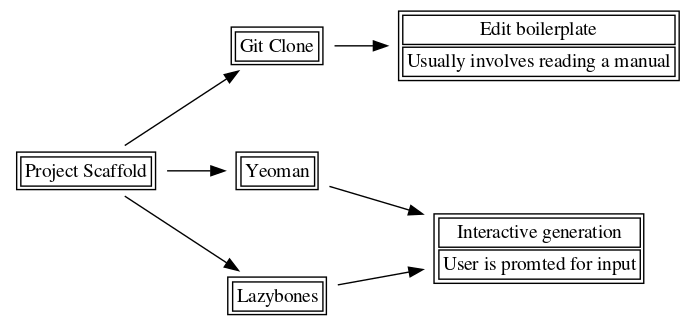

# Scaffolding Projects

Boilerplate code is everywhere. No project is complete without adhering to a
~best-practices~ structure or design. That being said, cross compatible,
language agnostic scaffolding tools are few and far apart. There is of course,
[Yeoman](http://yeoman.io/) for the web, along with a host of similar tools for specific languages,
like [Go](https://golang.org/pkg/text/template/).

All in, however, tools which work across multiple operating systems are few and
far apart. Previously for my own
[zenYoda](https://github.com/HaoZeke/zenYoda_Starter) and
[docuYoda](https://github.com/HaoZeke/zenYoda_Starter) projects, I dabbled in
using gulp. I still think gulp, [cmake](https://github.com/Kitware/CMake) and
friends are not bad choices for many use cases, however, the initial setup still
relied on a barbaric `git clone` and manual editing.

In essence [@test]



```bash
cat test.org
```
